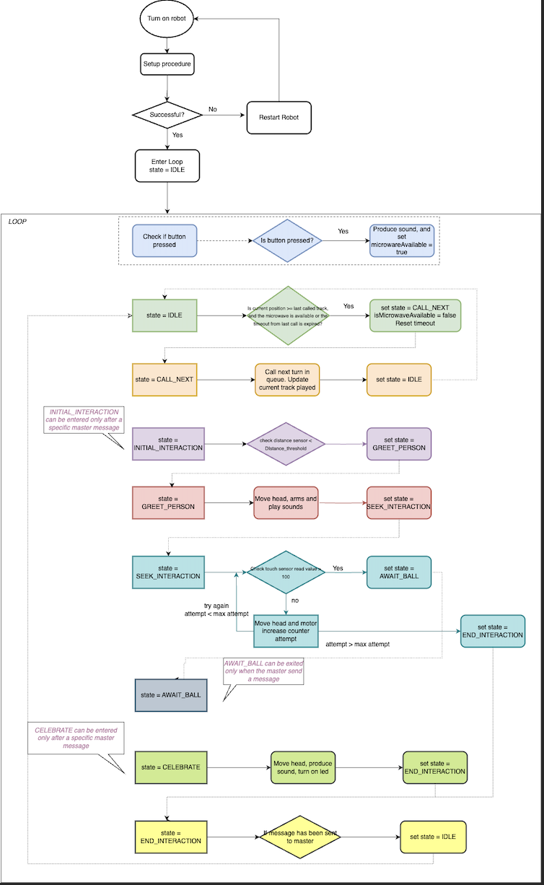
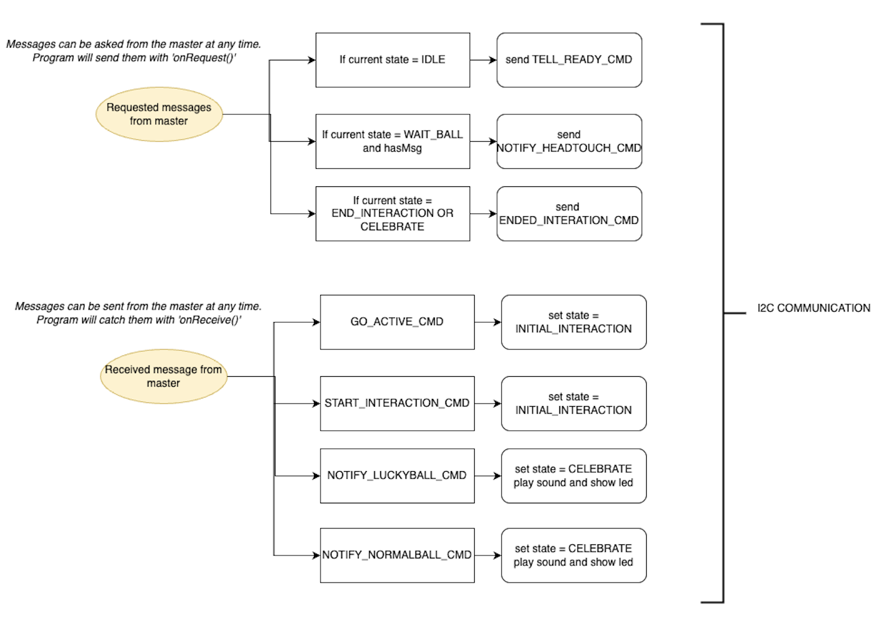

# Skipy : Indoor Communication Module – Robotics and Design Course (2025)

This project was developed as part of the *Robotics and Design* course in 2025.  
The goal was to design and build an interactive robot capable of detecting user presence and interaction through various sensors, performing human-like gestures using servos, playing pre-recorded audio, and displaying visual feedback via RGB LEDs.  
The robot also communicates with other modules via I2C, supporting a modular and expandable system architecture.

## Goal

The general idea is to have a robot composed of 5 cooperating modules whose goal is to assist the queue for microwaves during lunchtime. The code in this repository belongs to the alien module, placed on the spaceship, whose main purpose is to communicate with the user and manage the interaction.

Overall, the final robot moves around the space; as soon as it stops, it checks if there are people nearby. If it detects someone, it greets them and invites them to be petted. Touching the alien's head triggers a kind of lottery with two possible outcomes: either you get a lucky ball that allows you to skip the queue, or you get a normal ball and receive your number in the queue.

The queue number or the lucky ball message is delivered to the user via a ticket printed inside the spaceship, while the alien plays sounds to communicate the lottery outcome. The tickets contain a message encouraging people to return and press the button to notify when they have finished using the microwave.

From there, the spaceship starts moving again and the alien calls the next numbers in the queue.

## Queue Management

To keep track of the queue position, the program uses a counter that is updated each time the alien's head touch is notified to the other modules. Once the alien finishes the lottery interaction and communicates the result, it is ready to call the next number in the queue only if the number of tickets delivered is greater than the last number called.

However, before calling the next number, it checks if at least one microwave is available (a user has pressed the button) or if too much time has passed since the last call. The button is placed on the spaceship and can be pressed by the user as soon as they finish using the microwave. Each time the button is pressed, a flag is updated to keep track that a microwave is available.

When the program is in the `CALL_NEXT` state, it calls the next number, repeating it twice. If 30 tickets have been delivered, all counters are reset because the total number of tracks on the SD card is limited to 30 numbers.

## Required Components

- **3x Servo Motors** – To control the movement of the robot's head and arms.
- **1x HC-SR04 Ultrasonic Distance Sensor** – For detecting nearby users.
- **1x WS2812B RGB LED Strip** – For visual effects and interactive lighting.
- **Arduino Cables** – For connecting all hardware components.
- **1x Elegoo UNO R3 (or compatible Arduino board)** – Main microcontroller unit.
- **Resistors** – Used for voltage division and signal conditioning where needed.
- **1x Push Button** – Used for triggering interactions manually.
- **1x Speaker** – For audio feedback.
- **1x MP3-TF-16P Module** – For playing audio files from an SD card.
- **1x Audio Amplifier (optional)** – To improve audio output quality and volume.
- **1x 5V Power Supply** – For powering the microcontroller, servos, and sensors.
- **1x 12V Power Supply** – For powering the optional amplifier.

You can find the schematics for this components list in the folder `docs/Schematics.png`

## Before You Start

It is important to note that this robot is designed to work as part of a larger system and not as a standalone unit.  
However, to allow for individual testing and development, a separate branch named `standalone-version` is available.

To get started:

1. Download and install your preferred Arduino IDE (the standard Arduino IDE was used during development).
2. Open and compile the code from the repository.

## Code Overview

This project is developed for an interactive robot controlled by an Elegoo UNO R3 microcontroller. The robot’s behavior is organized as a **state machine** and is designed to be modular, responsive, and compatible with a master system via I2C.

### Libraries Used

- `Servo`: to control servo motors  
- `SoftwareSerial`: serial communication for the MP3 player  
- `SR04`: for distance measurement  
- `DFRobotDFPlayerMini`: for audio playback  
- `Adafruit_NeoPixel`: to manage the WS2812B RGB LED strip  
- `CapacitiveSensor`: for the capacitive touch sensor  
- `Wire`: for I2C communication  

### Initialization

At the beginning of the code, the following are defined:

- The necessary **libraries**  
- The **hardware pins** for each component  
- The **I2C addresses** and **communication commands**  
- The **enumerations** for the different states (`RobotState`, `ArmMotorsActions`, `HeadMotorsActions`)  
- The **global variables**, grouped by module (motors, sensors, LEDs, audio, etc.)  

### `setup()` Function

Inside the `setup()` function:

- Serial communication is initialized  
- Pins are assigned to the components  
- The I2C bus is configured  
- Servo motors are attached to their respective ports  
- The LED strip is initialized  
- The MP3 module startup is attempted; in case of failure, the system halts and LEDs turn red  

### `loop()` Function

The `loop()` function controls the robot’s behavior through a **state machine**. Each state represents a phase of interaction:

- `IDLE`: waiting for master message to start initial interaction, or waiting for user pressing button to call the next number in queue
- `INITIAL_INTERACTION`: waiting the detection of a nearby person  
- `GREET_PERSON`: greeting, moving head arms and producing sounds
- `SEEK_INTERACTION`: waiting for the user to touch the head  
- `AWAIT_BALL`: waiting for ball notification if lucky or normal one 
- `CELEBRATE`: celebration sounds and animations depending on the obtained ball
- `CALL_NEXT`: calling the next number in the queue 
- `END_INTERACTION`: session closure  

### Module Management

- **Motors (arms and head)**: actions are handled asynchronously using enums and timing variables to avoid blocking `delay()` calls.  
- **LEDs**: managed with timed updates and RGB animations.  
- **Sensors**:  
  - Ultrasonic sensor detects a person nearby.  
  - Capacitive sensor detects head touches.  
- **Audio**: every interaction or state can trigger sounds from the MP3 module using `playFolder`.  
- **Button**: used to notify when the microwave is available/free. Pressing it set the variable isMicrowaveAvailable that updates the queue status and starts related actions.  

### I2C Communication

The robot communicates with a master controller via the I2C protocol:

- Receives commands such as `START_INTERACTION_CMD`, `NOTIFY_LUCKYBALL_CMD`, etc.  
- Sends messages like `TELL_READY_CMD`, `NOTIFY_HEADTOUCH_CMD`, and `ENDED_INTERACTION_CMD` to the master when needed.  

### Notes

- Using enums and time management with `millis()` makes the robot’s behavior non-blocking and responsive.  
- The code is modular, with separate functions for each type of action (`sayHelloAction`, `resetHeadPositionAction`, `ledAnimationAction`, etc.)  
- The robot is designed to work in a coordinated ecosystem but also has a `standalone-version` version available on a separate branch.  

